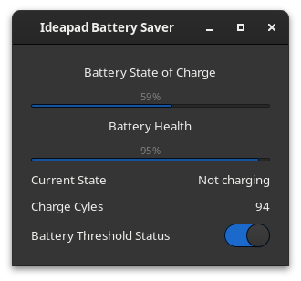

#    Ideapad Battery Saver
## Version 1.0

Battery information and threshold setting app for Ideapads on Linux

Tested on IdeaPad 3 15ALC6

## Screenshot

## Installation

### Dependencies

- gtk3-devel
- atk-devel
- cairo-gobject-devel
- vala
- meson
- ninja

` cd Ideapad-Battery Saver `

` meson build `

` cd build `

` ninja install `
